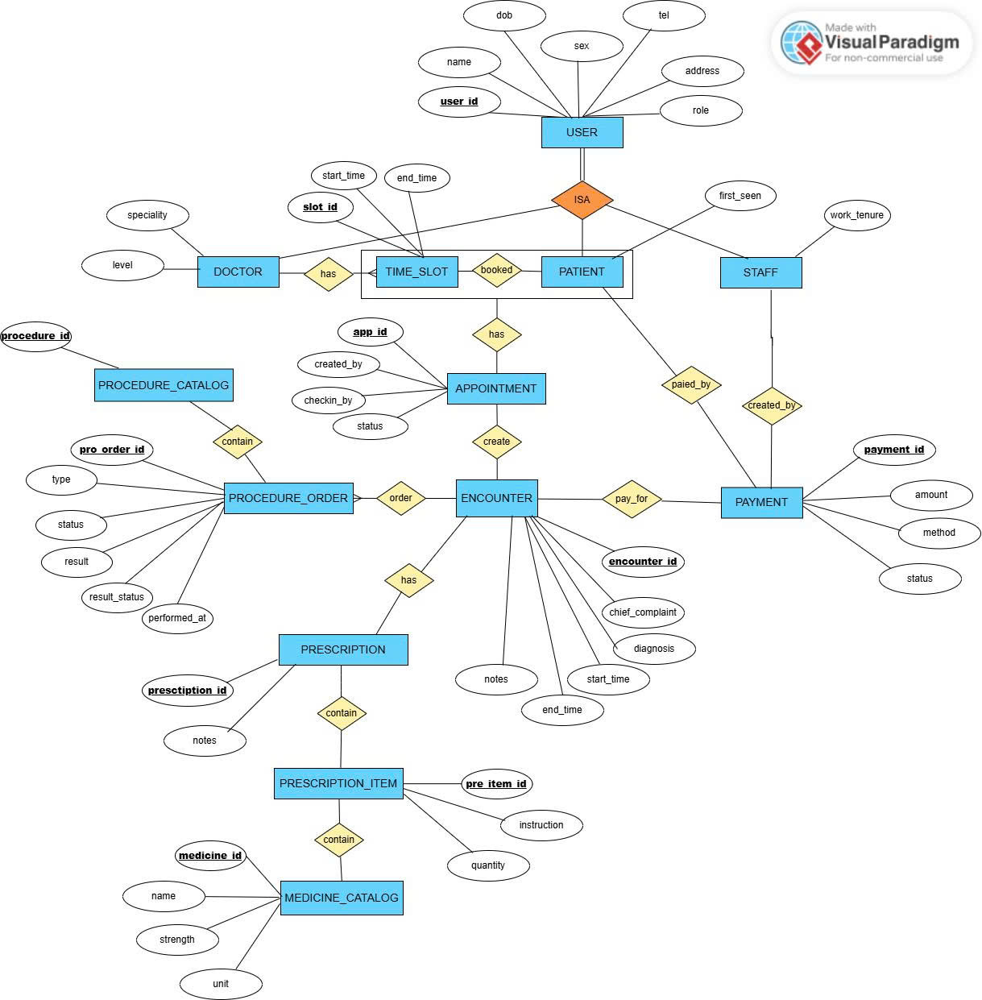

# Đề tài: Hệ thống quản lý phòng khám

> **Nhóm 2:**
> * **Hoàng Văn Chính - B23DCKH011**
> * **Nguyễn Ngọc Dương - B23DCCN221**
> * **Dương Thùy An - B21DCCN132**
> * **Lê Thị Thùy Trang - B23DCKH119**
> * **Đỗ Minh Hoàng - B23DCCN328**

## A. Giới thiệu đề tài
### I. GIới thiệu chung
Nhóm chúng em xây dựng **Hệ thống quản lý phòng khám** gồm các chuyên khoa: da liễu, phụ khoa, nam khoa với mục tiêu đáp ứng đồng thời hai nhu cầu quan trọng: bệnh nhân có thể dễ dàng đăng ký lịch khám bệnh online hoặc offline, tra cứu lịch sử kết quả khám bệnh; trong khi đó đội ngũ y bác sĩ và nhân viên quản trị bệnh viện có thể quản lý bệnh án, lịch khám, thuốc men, viện phí và báo cáo thống kê một cách tập trung, nhanh chóng và chính xác.

### II. Đối tượng sử dụng
Trong hệ thống, có 4 nhóm người dùng chính:
| Đối tượng            | Mô tả                                          |
| -------------------- | ---------------------------------------------- |
| Khách hàng           | Là người đi khám bệnh                          |
| Nhân viên hành chính | Là người tiếp nhận hồ sơ khám bệnh và thu ngân |
| Bác sĩ               | Bác sĩ                                         |
| Quản lý              | Quản lý nhân viên; thuốc; tài chính            |

### II. Luồng hoạt động
**1. Đặt lịch khám**
Bệnh nhân (`Patient`) (hoặc lễ tân `Staff`) chọn khung giờ của bác sĩ và phòng (`TimeSlot` của `Doctor` tại `ClinicRoom`) để tạo lịch hẹn (`Appointment`).

**2. Đến phòng khám & khám lâm sàng**
Khi tới nơi, bệnh nhân được gọi vào phòng; hệ thống mở lần khám (`Encounter`) gắn với lịch hẹn `Appointment`. Bác sĩ (`Doctor`) hỏi bệnh, để khám lâm sàng, ghi `chief_complaint`/ `notes`/ `diagnosis `trong `Encounter`.

**3. Chỉ định & thực hiện thủ thuật**
Nếu cần, bác sĩ tạo các thủ thuật chỉ định (`ProcedureOrder`) tham chiếu danh mục dịch vụ thủ thuật (`ProcedureCatalog`) cho lần khám đó.

Kỹ thuật viên thực hiện dịch vụ (nội bộ hoặc gửi ngoài) và cập nhật kết quả ngay trên `ProcedureOrder` (ví dụ: `result_text`, `performed_at`, `performed_by`).

**4. Bác sĩ trả kết quả & hoàn tất toa thuốc**
Bác sĩ xem kết quả từ `ProcedureOrder`, trao đổi kết luận với bệnh nhân, hoàn thiện `diagnosis` trong `Encounter`.

Nếu cần thuốc, bác sĩ lập toa thuốc (`Prescription`) và thêm các dòng thuốc (`PrescriptionItem`) (tham chiếu đến danh mục thuốc (`MedicineCatalog`)). Thuốc bệnh nhân tự mua ở ngoài.

## B. Thiết kế chi tiết của hệ thống

### I. Thông tin thực thể

#### a. Thực thể và Thuộc tính

##### 1. USER (Người dùng)

* `user_id` **(PK)**: mã người dùng
* `date_of_birth`: ngày sinh
* `sex` ('M', 'F', 'O'): giới tính
* `phone`: số điện thoại
* `address`: địa chỉ
* `email`: địa chỉ email
* `role`: vai trò

##### 2. PATIENT (Bệnh nhân)

* `has_visited`: đã từng khám (True or False)

##### 3. DOCTOR (Bác sĩ)

* `speciality`: Chuyên ngành (da liễu, phụ khoa, nam khoa)
* `qualification_level`: Trình độ chuyên môn

##### 4. STAFF (Nhân viên hành chính)

* `year_of_experience`

##### 5. CLINIC_ROOM (Phòng khám)

* `room_id` **(PK)**: mã phòng
* `room_type`: loại phòng (phòng khám da liễu, phụ khoa, nam khoa)
* `name`: tên phòng
* `location`: (ví dụ: phòng 305-tầng 3)

##### 6. TIME_SLOT

* `slot_id` **(PK)**
* `doctor_id`
* `star_time`
* `end_time`
* `status` (‘AVAILABLE’, ‘BOOKED’, ‘BLOCKED’)

##### 7. APPOINRMENT (Lịch khám) (Appointment) ["Thực thể tạo thành từ liên kết bệnh nhân, bác sĩ và TIME_SLOT"]

* `appointment_id` **(PK)**
* `patient_id`
* `doctor_id`
* `slot_id` 
* `status` (‘BOOKED’, ‘CONFIRMED’, ‘CHECKED_IN’, ‘COMPLETED’, ‘CANCELLED’)
* `created_by` (FK → User.user_id, staff)
* `checked_in_by` (FK → User.user_id, staff)

##### 8. ENCOUNTER (LẦN KHÁM)
* `encounter_id` **(PK)**
* `appointment_id`
* `initial_diagnosis`: chẩn đoán ban đầu
* `conclusion_result`: kết quả kết luận
* `fee`

##### 9. PROCEDURE (Thủ thuật)

* `procedure_id` **(PK)**
* `name`
* `description`
* `default_price`

##### 10. PROCEDURE_ORDER (Thủ thuật chỉ định)

* `procedure_order_id` **(PK)**
* `encounter_id`
* `procedure_id`
* `result_file` (kết quả trả về):

##### 11. MEDICINE (Thuốc)

* `medicine_id` **(PK)**
* `name`
* `strength`
* `unit`: (ví dụ: tablet, vial,...)
* `instruction`: hướng dẫn dùng

##### 12. PRESCRIPTION (Đơn thuốc)

* `prescription_id` **(PK)**: mã đơn thuốc
* `encounter_id`
* `medicine_id` ["1 đơn thuốc nhiều thuốc"]
* `quantity`

##### 13. PAYMENT (Thanh toán)

* `payment_id` **(PK)**
* `encounter_id`
* `staff_id`
* `amount`: tổng cộng chi phí
* `method`: ('CASH', 'CARD', 'TRANSFER')
* `date`
* `status` (‘PAID’, ‘UNPAID’) 

#### b. Quan hệ & ánh xạ

##### 1. User — Patient (ISA)
* **Cardinality**: User 1 — 0..1 Patient
* **Participation**: Patient total vào User; User partial
* **Mapping**: Patient.patient_id PK/FK → User.user_id (shared PK)

##### 2. User — Doctor (ISA)
* **Cardinality**: User 1 — 0..1 Doctor
* **Participation**: Doctor total; User partial
* **Mapping**: Doctor.doctor_id PK/FK → User.user_id (shared PK)

##### 3. ClinicRoom — TimeSlot
* **Cardinality**: ClinicRoom 1 — N TimeSlot
* **Participation**: TimeSlot total; ClinicRoom partial
* **Mapping**: TimeSlot.room_id NOT NULL FK → ClinicRoom.room_id

##### 4. Doctor — TimeSlot
* **Cardinality**: Doctor 1 — N TimeSlot
* **Participation**: TimeSlot total; Doctor partial
* **Mapping** / Ràng buộc:
TimeSlot.doctor_id NOT NULL FK → Doctor.doctor_id
UNIQUE (doctor_id, start_time) (chặn trùng khung)
CHECK (end_time > start_time)

##### 5. Patient — Appointment
* **Cardinality**: Patient 1 — N Appointment
* **Participation**: Appointment total; Patient partial
* **Mapping**: Appointment.patient_id NOT NULL FK → Patient.patient_id

##### 6. TimeSlot — Appointment
* **Cardinality**: TimeSlot 1 — 0..1 Appointment
* **Participation**: Appointment total; TimeSlot partial
* **Mapping** / Ràng buộc:
Appointment.slot_id NOT NULL FK → TimeSlot.slot_id
UNIQUE (slot_id) (mỗi slot tối đa 1 lịch)
Đồng bộ trạng thái: khi có Appointment ⇒ TimeSlot.status='BOOKED'

##### 7. Appointment — Encounter
* **Cardinality**: Appointment 1 — 0..1 Encounter
* **Participation**: Encounter total; Appointment partial
* **Mapping** / Ràng buộc:
Encounter.appointment_id NOT NULL UNIQUE FK → Appointment.appointment_id
Suy ra bác sĩ của Encounter qua Appointment.slot_id → TimeSlot.doctor_id (không cần cột doctor_id trong Encounter)

##### 8. Encounter — ProcedureOrder (đã gộp kết quả inline)
* **Cardinality**: Encounter 1 — N ProcedureOrder
* **Participation**: ProcedureOrder total; Encounter partial
* **Mapping** / Ràng buộc:
ProcedureOrder.encounter_id NOT NULL FK → Encounter.encounter_id
ProcedureOrder.procedure_code NOT NULL FK → ProcedureCatalog.procedure_code
Trạng thái: status ∈ {REQUESTED, IN_PROGRESS, COMPLETED, CANCELLED}
Kết quả inline: result_status ∈ {PENDING, READY, AMENDED}, result_text, performed_at, performed_by FK → User.user_id

##### 9. Procedure — ProcedureOrder
* **Cardinality**: Procedure 1 — N ProcedureOrder
* **Participation**: ProcedureOrder total; Procedure partial
* **Mapping**: ProcedureOrder.procedure_code FK → Procedure.procedure_code

##### 10. Encounter — Prescription
* **Cardinality**: Encounter 1 — 0..1 Prescription
* **Participation**: Prescription total; Encounter partial
* **Mapping** / Ràng buộc:
Prescription.encounter_id NOT NULL UNIQUE FK → Encounter.encounter_id

##### 11. Prescription — PrescriptionItem
* **Cardinality**: Prescription 1 — N PrescriptionItem
* **Participation**: PrescriptionItem total; Prescription partial
* **Mapping** / Ràng buộc:
PrescriptionItem.prescription_id NOT NULL FK → Prescription.prescription_id
CHECK (quantity > 0)

##### 12. Medicine — PrescriptionItem
* **Cardinality**: Medicine 1 — N PrescriptionItem
* **Participation**: PrescriptionItem total; Medicinepartial
* **Mapping**: PrescriptionItem.medicine_code FK → Medicine.medicine_code

##### 13. Encounter — Payment
* **Cardinality**: Encounter 1 — N Payment (hoặc 1—0..1 nếu mỗi ca chỉ thu 1 lần)
* **Participation**: Payment total; Encounter partial
* **Mapping** / Ràng buộc:
Payment.encounter_id NOT NULL FK → Encounter.encounter_id
Payment.patient_id NOT NULL FK → Patient.patient_id
Payment.staff_user_id FK → User.user_id (người thu, role=STAFF)
Ràng buộc nhất quán BN: đảm bảo Payment.patient_id khớp với bệnh nhân của Encounter (thực thi bằng trigger hoặc view with check option)
method ∈ {CASH, CARD, EWALLET, INSURANCE}, status ∈ {PAID, UNPAID}

### II. Mô hình E-R

Viết lại thực thể -> Vẽ ER -> Chuyển thành lược đồ quan hệ -> Tạo TABLE trong MySQL (MySQL WorkBench) & insert một số data sẵn -> [Xong Frontend]

- Viết query
- Code JDBC
- Code Feature (nhiều)