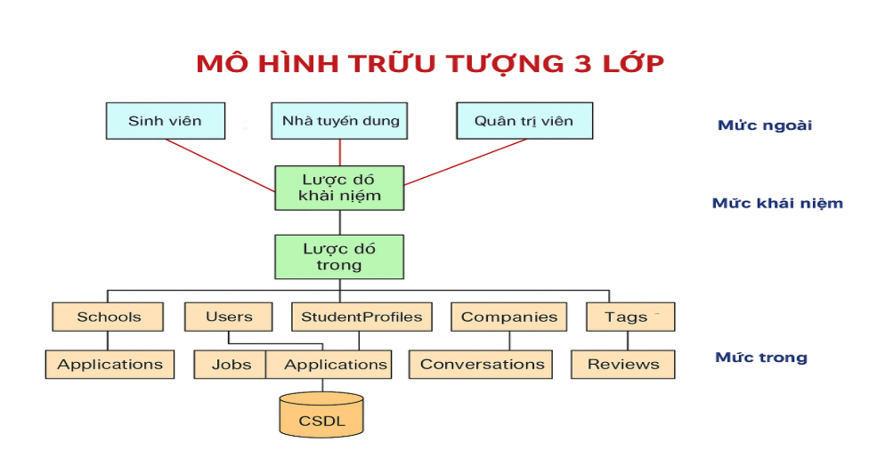

# Đề tài: Hệ thống quản lý bệnh viện

> **Nhóm 2:**
> * **Hoàng Văn Chính - B23DCKH011**
> * **Nguyễn Ngọc Dương - B23DCCN221**
> * **Dương Thùy An - B21DCCN132**
> * **Lê Thị Thùy Trang - B23DCKH119**
> * **Đỗ Minh Hoàng - B23DCCN328**

## A. Giới thiệu đề tài
Trong bối cảnh nhu cầu chăm sóc sức khỏe ngày càng cao và quy mô hoạt động của các bệnh viện ngày càng mở rộng, việc ứng dụng công nghệ thông tin vào quản lý trở thành một xu thế tất yếu.

Chính vì vậy, nhóm chúng em xây dựng **Hệ thống quản lý bệnh viện** với mục tiêu đáp ứng đồng thời hai nhu cầu quan trọng: bệnh nhân có thể dễ dàng đăng ký khám bệnh, tra cứu thông tin và theo dõi hồ sơ sức khỏe trực tuyến; trong khi đó đội ngũ y bác sĩ và nhân viên quản trị bệnh viện có thể quản lý bệnh án, lịch khám, thuốc men, viện phí và báo cáo thống kê một cách tập trung, nhanh chóng và chính xác.

## B. Đối tượng sử dụng
Trong hệ thống quản lý bệnh viện, có 4 nhóm người dùng chính:
| Đối tượng            | Mô tả                                                            |
| -------------------- | ---------------------------------------------------------------- |
| Bệnh nhân            | Là người đi khám bệnh và người nhập viện                         |
| Nhân viên hành chính | Là người tiếp nhận hồ sơ bệnh nhân khám và nhập viện và thu ngân |
| Bác sĩ               | Bác sĩ                                                           |
| Quản lý              | Quản lý nhân viên; thiết bị; thuốc, vật tư y tế; tài chính       |
| Giám đốc bệnh viện   | Người điều hành cấp cao nhất                                     |

## C. Thiết kế chi tiết của hệ thống

### I. Mức ngoài - Khung nhìn người dùng

#### 1. Bệnh nhân

* **C**reate:
  * Tạo tài khoản online
  * Hẹn lịch khám online

* **R**ead:
  * Thông tin cá nhân
  * Lịch sử khám bệnh hoặc nhập viện
  * Tình trạng bệnh
  * Đơn thuốc đã được kê
  * Thông tin cơ bản của bác sĩ phụ trách
  * Đối với bệnh nhân nhập viện: xem bệnh án

* **U**pdate:
  * Thông tin cá nhân
  * Lịch khám chưa duyệt

* **D**elete: NULL

#### 2. Nhân viên hành chính
* **C**reate:
  * Hồ sơ bệnh nhân
  * Lịch khám
  * Hóa đơn thanh toán

* **R**ead:
  * Hồ sơ bệnh nhân
  * Lịch khám
  * Danh sách bác sĩ và tình trạng thời gian thực
  * Danh sách giường trống và full

* **U**pdate:
  * Hồ sơ bệnh nhân
  * Lịch khám
  * Hóa đơn thanh toán
  * Danh sách bác sĩ và tình trạng thời gian thực
  * Danh sách giường trống và full

* **D**elete: 
  * Hồ sơ bệnh nhân

#### 3. Bác sĩ
* **C**reate:
  * Bệnh án
  * Dịch vụ chẩn đoán
  * Đơn thuốc

* **R**ead:
  * Lịch sử bệnh án
  * Lịch sử đơn thuốc
  * Danh sách bệnh nhân chờ
  * Danh sách bệnh nhân đang nhập viện bản thân phụ trách

* **U**pdate:
  * Bệnh án
  * Dịch vụ chẩn đoán
  * Đơn thuốc
  * Tình trạng: rảnh hay bận

* **D**elete: NULL

#### 4. Quản lý
* **C**reate:
  * Nhân viên hành chính, bác sĩ
  * Trang thiết bị
  * Dịch vụ chẩn đoán
  * Loại thuốc, vật tư y tế
  * Các khoản chi

* **R**ead:
  * Nhân viên hành chính, bác sĩ
  * Trang thiết bị
  * Dịch vụ chẩn đoán
  * Loại thuốc, vật tư y tế
  * Các khoản chi
  * Tình trạng phòng: trống hay full
  * Báo cáo thu chi, thống kê bệnh nhân

* **U**pdate:
  * Nhân viên hành chính, bác sĩ
  * Trang thiết bị
  * Dịch vụ chẩn đoán
  * Loại thuốc, vật tư y tế

* **D**elete: 
  * Nhân viên hành chính, bác sĩ
  * Trang thiết bị
  * Dịch vụ chẩn đoán
  * Loại thuốc, vật tư y tế